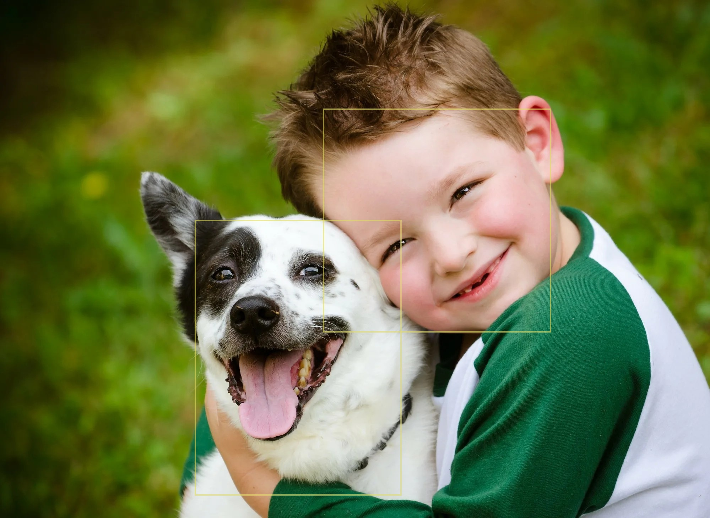
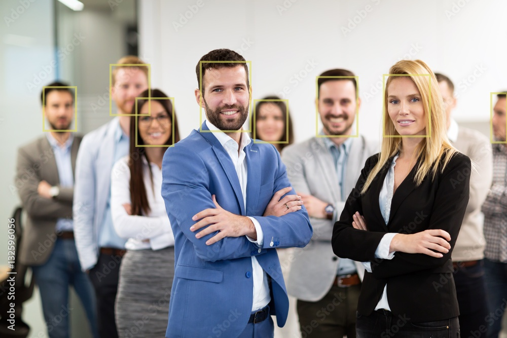
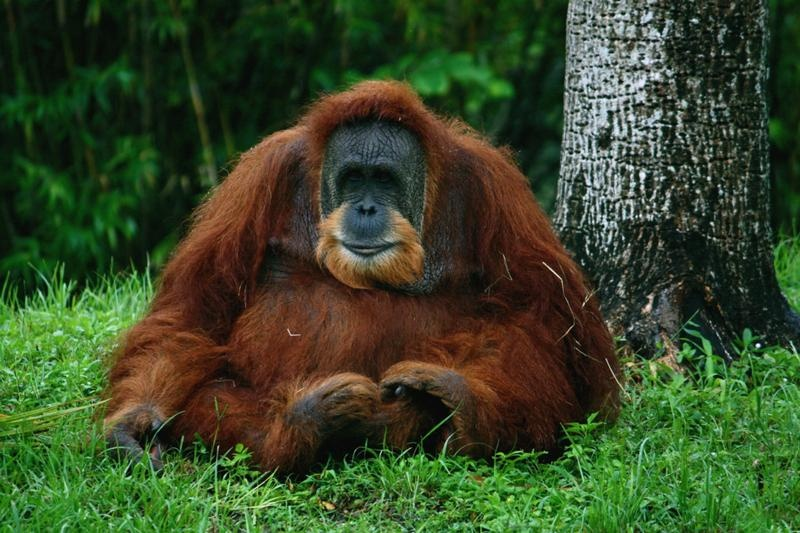
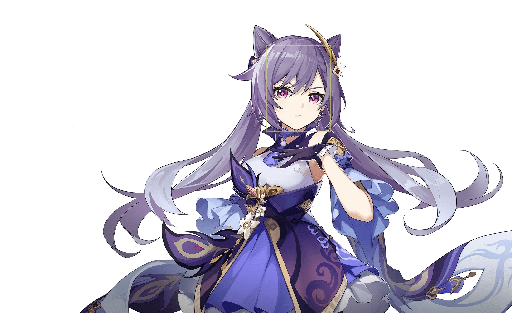

# faceDetector_YOLOv5

Этот репозиторий просто использует оригинальный репозиторий с YOLOv5, размещенный по [адресу](https://github.com/ultralytics/yolov3) 🧐.

Оригинальный репозиторий содержит все необходимое для обучения моделей YOLOv5, как малых 🤏🏻, так и огромных 🦣, как детекционных 🔲, так и сегментационных 🫥.

В данном репозитории представлен результат тренировки YOLOv5x на самособранном датасете - один класс "Человек" 👱🏻. Для создания датасета использовались стоковые люди и прочие сервисы с бесплатными 🤑 стоковыми фотографиями людей. Разметка производилась вручную 💪🏻 на [сайте](https://www.makesense.ai/) прямоугольниками 🔲 и сохранялась в формате YOLO 🕶️.

Обучение модели производилось на основе огромной предобученной на COCO-датасете модели YOLOv5x 🦣. Количество эпох обучения - 100 🧠, время обучения ~1 час 🕐 (RTX 4070s 🚀). Для обучения использовались штатные средства оригинального репозитория ⚒️.

### Установка

Для установки необходимо клонировать ©️ репозиторий (при клонировании большой бинарный файл может замениться указателем, в таком случае, просто докачайте его вручную, сверьте хэш и киньте в репозиторий) и установить requirements.txt, после чего можно закинуть в папку test_images необходимые изображения 🖼️ и открыть click_to_launch.cmd ▶️, папку results можно даже удалить 🚮 перед тестом, она создастся при тесте, а протестированные изображения 🖼️▶️ будут иметь изначальное название + _result. В случае повторения файлов они перезаписываются 🔁.

### Подготовленные тесты

В репозитории уже есть тесты и их результаты 👀. Модель успешно детектирует лица людей 👱🏻 и существ, на них похожих 🙉. При этом в коде программы можно изменить conf, этот параметр отвечает за то, детекции с какой вероятностью выводить на экран. По приколу сейчас стоит 0.2 - это означает, что фрагменты изображения, на которых модель нашла "человеческое" лицо и уверена в этом больше чем на 20%, будут обрамлены прямоугольником, из-за чего могут наблюдаться некоторые странности, но за то детекция лиц в более трудных условиях становится возможной.

### Примеры

Один человек 👱🏻.

Человек собаке друг 👱🏻🐕.

Много людей + блюр 👱🏻👱🏻👱🏻👱🏻.

Орангутан (2 случая) 🙉🙉.

Персонаж из компьтерной игры 🎮👾.

Изображение человека, созданное нейросетью Dall-E 3 🙅🏻.

Больше тестов находится в results 🔎.

### Уточнение

При выставлении conf на 0.85 почти все "странные" 🐕🙉 детекции уходят, и остаются только у людей, настоящих, сгенерированных и нарисованных, но людей, а не собак.

0.2 было выставлено по большей части для того, чтобы просто хорошо посмеяться 😂, не принимайте это всерьёз 😁👍🏻👌🏻.
